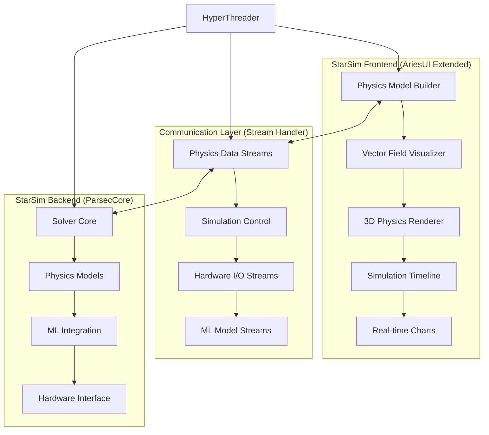

# StarSim - Real-Time Physics Simulation Engine

[](https://github.com/AryanRai/Comms)
[](ParsecCore/)
[](LICENSE)

> **A complete physics simulation and computation engine with real-time capabilities, featuring a portable C++ backend (ParsecCore) and seamless integration with Comms Alpha v3.0 for visualization and hardware interfacing.**

StarSim provides a comprehensive ecosystem for physics simulation, from embedded microcontroller applications to desktop visualization, with real-time data processing, machine learning integration, and hardware-in-the-loop capabilities.

## Project Structure

```
StarSim/
├── ParsecCore/                 # C++ simulation engine
│   ├── include/               # Organized header files
│   │   ├── parsec/           # Core simulation headers
│   │   ├── mlcore/           # ML functionality headers
│   │   ├── mathcore/         # Math utilities headers
│   │   ├── physcore/         # Physics modules
│   │   ├── tradingcore/      # TradingCore headers
│   │   ├── platform/         # Platform abstraction headers
│   │   ├── comms/            # Communication layer
│   │   └── timing/           # Timing layer
│   ├── src/                  # Organized implementation files
│   │   ├── parsec/           # Core simulation implementations
│   │   ├── mlcore/           # ML functionality implementations
│   │   ├── mathcore/         # Math utilities implementations
│   │   ├── physcore/         # Physics modules implementations
│   │   ├── tradingcore/      # TradingCore implementations
│   │   └── platform/         # Platform implementations
│   ├── examples/             # Example applications (trading, ML, physics)
│   ├── tests/                # Unit tests and test data
│   ├── CMakeLists.txt        # Build configuration
│   └── README.md             # ParsecCore documentation
├── Test/                      # Legacy test directory
└── README.md                  # This file
```

## ParsecCore

**ParsecCore** is the portable, embeddable C++ runtime engine designed for real-time physics simulation and computation within the StarSim ecosystem. It loads system descriptions from configuration files, solves the defined equations over time using numerical methods, and integrates with various platforms via an abstraction layer.

### Current Status:
*   **Organized Structure:** Clean separation of headers and implementations by component (parsec, mlcore, mathcore, physcore, tradingcore, platform)
*   **Model Loading:** Loads models from `.starmodel.json` files (`ConfigManager`)
*   **Equation Parsing:** Uses **muParser** for mathematical expressions (`EquationManager`)
*   **Numerical Solving:** Implements **Forward Euler** solver (`SolverCore`)
*   **Platform Abstraction:** Abstracts platform details via `IPlatform`
*   **ML Integration:** Optional `MLCore` for PID optimization and system prediction
*   **Build System:** Uses **CMake** with automatic dependency management (`googletest`, `nlohmann/json`, `muParser`)
*   **Examples:** Includes basic simulation, ML, and trading demonstration applications
*   **Testing:** Comprehensive unit tests for all core components

### Key Features:
- **Real-time Physics Simulation:** Forward Euler integration with configurable time steps
- **JSON Configuration:** Human-readable model definitions with variables, equations, and solver settings
- **ML-Enhanced Simulation:** Optional machine learning for PID optimization and predictive modeling
- **Cross-Platform:** Supports Windows, Linux, and embedded systems via platform abstraction
- **Modular Design:** Use only the components you need (core simulation, ML, math utilities, trading)

For detailed information on building and using ParsecCore, see the [ParsecCore README](./ParsecCore/README.md).

For ML Core functionality and configuration, see the [ML README](./ParsecCore/ML_README.md).

---

## TradingCore (Planned & Implemented)

**TradingCore** is a modular trading engine for stocks, ETFs, and forex, designed for low-capital, real-time, and backtesting scenarios. It leverages:
- **IEX real-time data** (via Alpaca free tier) for US stocks/ETFs (SPY, QQQ, GOOGL, NVDA, TSLA, PLTR, etc.)
- **15-minute delayed SIP data** (via Alpaca) for backtesting and simulation
- **OANDA real-time forex data** for currency trading (e.g., EUR/USD)
- **Yahoo Finance** for historical and delayed data (backtesting)

### Implemented Modules
- `include/tradingcore/TradingCore.h` / `src/tradingcore/TradingCore.cpp`: TradingCore API and core logic (stubbed, needs full signal integration)
- `include/tradingcore/TradingDataStructures.h`: Core trading data types
- `include/tradingcore/modules/MarketData.h`: Market data abstraction (header)
- `include/tradingcore/modules/SignalGenerator.h`: Signal generation strategies (header)
- `include/tradingcore/modules/PortfolioManager.h`: Portfolio optimization (header)
- `include/tradingcore/modules/TradeExecutor.h`: Trade execution logic (header)
- `include/tradingcore/modules/SimulationEngine.h`: Backtesting and simulation (header)
- `include/tradingcore/static/TradingConstants.h` / `src/tradingcore/static/TradingConstants.cpp`: Trading constants

### Planned/Upcoming Modules
- `include/tradingcore/modules/LowCapitalStrategy.h` / `.cpp`: Strategies for $1-$100 portfolios (fractional shares, forex)
- `include/tradingcore/modules/DataAdapter.h` / `.cpp`: Multi-source data adapter (IEX, SIP, OANDA, Yahoo)
- `include/tradingcore/modules/FinancialModels.h` / `.cpp`: Financial calculations (returns, volatility, Sharpe, CVaR)
- `include/tradingcore/modules/RiskManager.h` / `.cpp`: Advanced risk management (CVaR, ATR stops)
- `include/tradingcore/modules/SentimentAnalyzer.h` / `.cpp`: Sentiment analysis (X API, BERT)
- `include/tradingcore/modules/VolatilityForecast.h` / `.cpp`: Volatility forecasting (GARCH, LSTM)
- `include/tradingcore/modules/OptionsPricing.h` / `.cpp`: Options pricing (optional)
- `include/tradingcore/modules/MacroIndicator.h` / `.cpp`: Macroeconomic data (FRED)

### Data Source Strategy
- **Primary:** IEX real-time data for signals and paper trading (Alpaca free tier)
- **Backtesting:** 15-minute delayed SIP data (Alpaca) and Yahoo Finance
- **Forex:** OANDA real-time data for currency trading
- **Fallbacks:** Yahoo Finance for historical/delayed data, FRED for macro, X API for sentiment

### Advanced Features (Planned)
- DRL (Deep Q-Learning) and ML-based signals (MLCore)
- Volatility forecasting (GARCH, LSTM)
- Sentiment analysis (X API, BERT)
- Portfolio optimization (MPT, CVaR)
- Fractional share and micro-lot trading
- Robust risk management (CVaR, ATR stops)
- Real-time and backtesting simulation
- Visualization and monitoring (AriesUI, Twilio alerts)

### Improvement Phases
1. **Core System with IEX/SIP/OANDA/Yahoo Data**: Implement data adapters, signal generation, and basic strategies for low-capital trading
2. **Advanced Modeling and Sentiment**: Add DRL, volatility forecasting, and sentiment analysis
3. **Optional Funding and Live Trading Prep**: Enable full SIP data and live trading with a funded Alpaca account
4. **Live Trading and Monitoring**: Deploy, monitor, and visualize live trading performance

---

## MLCore (Implemented & Planned)

**MLCore** provides machine learning and optimization capabilities for simulation, trading, and control. It is designed for:
- Using solved physics or trading data to train models
- Real-time inference and feedback into simulation (closed-loop AI)
- Tensor and matrix export/import (ONNX, TensorRT planned)

### Implemented Modules
- `include/mlcore/MLCore.h` / `src/mlcore/mlcore.cpp`, `src/mlcore/modules/MLCore.cpp`: Core ML engine and logic
- `include/mlcore/MLDataStructures.h`: Data structures for ML models and datasets
- `include/mlcore/modules/DataCollection.h`: Data collection utilities
- `include/mlcore/modules/LinearRegression.h`: Linear regression model
- `include/mlcore/modules/PIDOptimizer.h`: PID parameter optimization

### Planned/Upcoming Modules
- ONNX Runtime integration for external model import/export
- Kalman filter support for state estimation
- Neural network support (feedforward, LSTM, etc.)
- Model export/import (TensorRT, ONNX)
- Advanced reinforcement learning (DRL, Q-Learning)

### Example Use Cases
- **PID Core Development:**
  1. MLCore optimizes PID parameters
  2. PID Core implements the actual control logic
  3. Real-time feedback for continuous optimization
  4. Servo/motor control applications
- **Physics/Trading:**
  - Use simulation or trading data to train predictive models
  - Real-time inference for adaptive control or trading

### Extension Points
- Add ONNX Runtime for external models
- Implement Kalman filters
- Add neural network support
- Create model export/import

---

## MathCore (Implemented & Planned)

**MathCore** provides mathematical utilities, algorithms, and numerical methods for simulation, ML, and trading. It is designed for:
- Core math operations (arithmetic, statistics, linear algebra)
- Numerical methods for solvers and optimizers
- Foundation for MLCore, PhysCore, and TradingCore modules

### Implemented Modules
- `include/mathcore/math.h` / `src/mathcore/math.cpp`: MathCore API and basic math logic
- `include/mathcore/modules/BasicMath.h` / `src/mathcore/modules/BasicMath.cpp`: Basic math operations
- `include/mathcore/modules/LinearAlgebra.h`: Matrix and vector operations
- `include/mathcore/modules/NumericalMethods.h`: Numerical algorithms (integration, differentiation, etc.)
- `include/mathcore/modules/Statistics.h`: Statistical functions

### Planned/Upcoming Modules
- Optimization algorithms (gradient descent, simplex, etc.)
- Advanced matrix decompositions (SVD, QR, etc.)
- Symbolic math support
- Math constants and static tables

### Extension Points
- Add optimization routines for ML and trading
- Expand matrix and tensor support
- Integrate with external math libraries (Eigen, BLAS, etc.)

---

## PhysCore (Implemented & Planned)

**PhysCore** provides physics models, constants, and utilities for simulation and engineering applications. It is designed for:
- Modeling statics, dynamics, thermofluids, and material science
- Providing reusable physics modules for simulation and control
- Supplying constants and utility functions for engineering

### Implemented Modules
- `include/physcore/PhysCore.h` / `src/physcore/physcore.cpp`: PhysCore API and core logic
- `include/physcore/PhysicsConstants.h`: Physics constants
- `include/physcore/PhysicsUtils.h`: Utility functions for physics calculations
- `include/physcore/modules/Statics.h`: Statics models
- `include/physcore/modules/Dynamics.h`: Dynamics models
- `include/physcore/modules/Thermofluids.h`: Thermofluids models
- `include/physcore/modules/Controls.h`: Controls and feedback systems
- `include/physcore/modules/MaterialScience.h`: Material science models
- `src/physcore/modules/PhysCore.cpp`: Implementation for core physics modules

### Planned/Upcoming Modules
- Stochastic processes for uncertainty modeling
- Advanced control theory (state-space, observers)
- FEM (finite element method) support
- Symbolic physics modeling

### Extension Points
- Add stochastic and uncertainty modeling
- Integrate advanced control and estimation algorithms
- Expand to multi-physics and coupled systems

---

## 🌟 Comms Alpha v3.0 Integration

StarSim leverages the proven architecture of **Comms Alpha v3.0** to accelerate development while maintaining independence. This integration provides a complete frontend, communication layer, and hardware interfacing system.

### Integration Architecture



### Key Integration Components

The integration between StarSim and Comms Alpha v3.0 is now implemented with these key components:

1. **InputManager (C++)**: A new C++ class that connects ParsecCore simulations to the Stream Handler WebSocket server, enabling real-time data exchange between the physics engine and the UI.

2. **Physics-specific Stream Protocol**: An extension to the Stream Handler protocol that supports physics simulation data, including vectors, matrices, and specialized physics quantities.

3. **AriesUI Physics Widgets**: A set of specialized widgets for physics visualization:
   - **PhysicsValueMonitor**: Displays physics values with units and trend indicators
   - **PhysicsChart**: Real-time charts for physics data visualization
   - **PhysicsVectorField**: 2D vector field visualization for forces, velocities, etc.
   - **PhysicsControlPanel**: Interface for controlling simulation parameters

### Example Integration

```cpp
// C++ example using InputManager
#include "parsec/InputManager.h"

int main() {
    // Create input manager for simulation
    parsec::InputManager input_manager("spring_mass_system");
    input_manager.initialize("ws://localhost:3000");
    
    // Register streams
    input_manager.registerStream("position", "Position", "float", "m");
    input_manager.registerStream("velocity", "Velocity", "float", "m/s");
    
    // Update simulation status
    input_manager.updateStatus("running");
    
    // Simulation loop
    for (int i = 0; i < 1000; ++i) {
        // Update simulation
        position += velocity * dt;
        velocity += acceleration * dt;
        
        // Send to Stream Handler
        input_manager.updateStreamValue("position", position);
        input_manager.updateStreamValue("velocity", velocity);
        
        // Sleep to control simulation speed
        std::this_thread::sleep_for(std::chrono::milliseconds(10));
    }
    
    return 0;
}
```

For detailed integration documentation, see [INTEGRATION.md](INTEGRATION.md).

### Component Integration Map

| Comms Component | StarSim Integration | Implementation |
|----------------|-------------------|----------------|
| **AriesUI** | StarSim Frontend | Extended with physics-specific widgets and 3D visualization |
| **Stream Handler** | Orchestration Layer | Real-time data flow between frontend and ParsecCore |
| **Engine + Dynamic Modules** | I/O Manager | Hardware interfacing for sensors, actuators, and embedded devices |
| **HyperThreader** | System Orchestrator | Manage StarSim instances, debugging, and performance monitoring |

### StarSim-Specific Extensions

#### 🎯 Physics Visualization Widgets (AriesMods)
```typescript
// Physics-specific AriesMods widgets
ariesMods/
├── physics/
│   ├── VectorFieldVisualizer.tsx    # Force/velocity field display
│   ├── PhysicsModelBuilder.tsx      # Drag-and-drop system builder
│   ├── SimulationTimeline.tsx       # Time scrubbing control
│   ├── 3DPhysicsRenderer.tsx        # Three.js 3D visualization
│   ├── SolverMonitor.tsx            # Real-time solver performance
│   └── EquationEditor.tsx           # Mathematical equation input
```

#### 🔄 Physics Data Streams
```json
{
  "type": "physics_simulation",
  "status": "active",
  "data": {
    "simulation_id": "drone_flight_dynamics",
    "solver_info": {
      "method": "RK4",
      "timestep": 0.001,
      "convergence": "stable"
    },
    "streams": {
      "position": {
        "stream_id": 201,
        "name": "Drone Position",
        "datatype": "vector3",
        "unit": "m",
        "value": [1.2, 0.8, 2.1],
        "metadata": {
          "coordinate_system": "world",
          "reference_frame": "NED"
        }
      },
      "forces": {
        "stream_id": 202,
        "name": "Applied Forces",
        "datatype": "vector3",
        "unit": "N",
        "value": [0.1, 0.0, -9.81]
      }
    }
  }
}
```

#### 🎮 Headless Mode for Embedded Systems
```cpp
// Headless StarSim configuration
{
  "headless_mode": true,
  "ui_profile": "drone_control_locked",
  "output_streams": ["position", "velocity", "attitude"],
  "hardware_interfaces": {
    "imu": "/dev/ttyUSB0",
    "motors": "pwm_channels_1_4"
  },
  "animation_config": {
    "3d_model": "drone_mesh.obj",
    "update_rate": 30
  }
}
```

### Development Workflow

#### Phase 1: Core Integration (Current)
- ✅ Git submodule setup
- ✅ Integration branch structure
- 🚧 Stream Handler physics data extensions
- 🚧 Basic physics AriesMods widgets
- 📋 ParsecCore communication protocol

#### Phase 2: Advanced Features
- 📋 3D visualization with Three.js
- 📋 Hardware-in-the-loop simulation
- 📋 ML model integration streams
- 📋 Multi-physics domain support

#### Phase 3: Production Ready
- 📋 Headless mode for embedded systems
- 📋 Performance optimization
- 📋 Real-world validation
- 📋 Documentation and examples

### Quick Start with Comms Integration

```bash
# From Comms repository root
cd int/StarSim

# Build ParsecCore
cd ParsecCore && mkdir build && cd build
cmake .. && cmake --build .

# Test ParsecCore
ctest

# Start integrated system (from Comms root)
cd ../../../
python HyperThreader.py  # Now includes StarSim management
```

### Stream Integration Examples

#### Physics Simulation Stream
```python
# Engine Dynamic Module for StarSim
class StarSimModule:
    def __init__(self):
        self.streams = {
            "position": Stream(301, "Position", "vector3", "m"),
            "velocity": Stream(302, "Velocity", "vector3", "m/s"),
            "acceleration": Stream(303, "Acceleration", "vector3", "m/s²")
        }
    
    async def update_streams_forever(self):
        while True:
            # Get data from ParsecCore
            sim_data = self.parsec_core.getCurrentState()
            self.streams["position"].update_value(sim_data.position)
            self.streams["velocity"].update_value(sim_data.velocity)
            await asyncio.sleep(0.001)  # 1ms updates for real-time
```

#### AriesUI Physics Widget
```typescript
// StarSim-specific widget
const PhysicsVectorField: React.FC<AriesModProps> = ({
  title,
  data,
  config
}) => {
  const position = useCommsStream('starsim.position')
  const velocity = useCommsStream('starsim.velocity')
  
  return (
    <Card className="w-full h-full">
      <CardHeader>
        <CardTitle>{title}</CardTitle>
      </CardHeader>
      <CardContent>
        <Canvas>
          <VectorField 
            position={position.value}
            velocity={velocity.value}
            scale={config.scale}
          />
        </Canvas>
      </CardContent>
    </Card>
  )
}
```

## Quick Start

1. **Navigate to ParsecCore:**
   ```bash
   cd ParsecCore
   ```

2. **Build the project:**
   ```bash
   mkdir build && cd build
   cmake ..
   cmake --build .
   ```

3. **Run tests:**
   ```bash
   ctest
   ```

4. **Run examples:**
   ```bash
   # Basic physics simulation
   ./Debug/parsec_windows_app.exe
   
   # ML demonstration
   ./Debug/parsec_ml_example.exe
   
   # Trading examples (see ParsecCore/examples/)
   # e.g.,
   ./Debug/alpaca_simple.exe
   ./Debug/advanced_paper_trading.exe
   ./Debug/simple_paper_trading.exe
   ```

## Integration Examples

### Embedding ParsecCore
```cpp
#include "parsec/ParsecCore.h"
#include "platform/IPlatform.h"

// Your platform implementation
class MyPlatform : public IPlatform {
    // ... implement virtual methods
};

// Use ParsecCore
MyPlatform platform;
ParsecCore core(&platform);
core.loadModel("model.starmodel.json");

// Optional ML features
core.loadMLConfiguration("ml_config.json");

// Run simulation
while (running) {
    core.tick();
    auto state = core.getCurrentState();
    // Process simulation results...
}
```

### Model Configuration
```json
{
  "model_name": "SpringMassSystem",
  "variables": [
    {"name": "x", "type": "dynamic", "initial": 0.5},
    {"name": "v", "type": "dynamic", "initial": 0.0},
    {"name": "k", "type": "constant", "value": 10.0}
  ],
  "equations": [
    "d(x)/dt = v",
    "d(v)/dt = -k * x"
  ],
  "solver": {"method": "Euler", "dt": 0.001}
}
```
